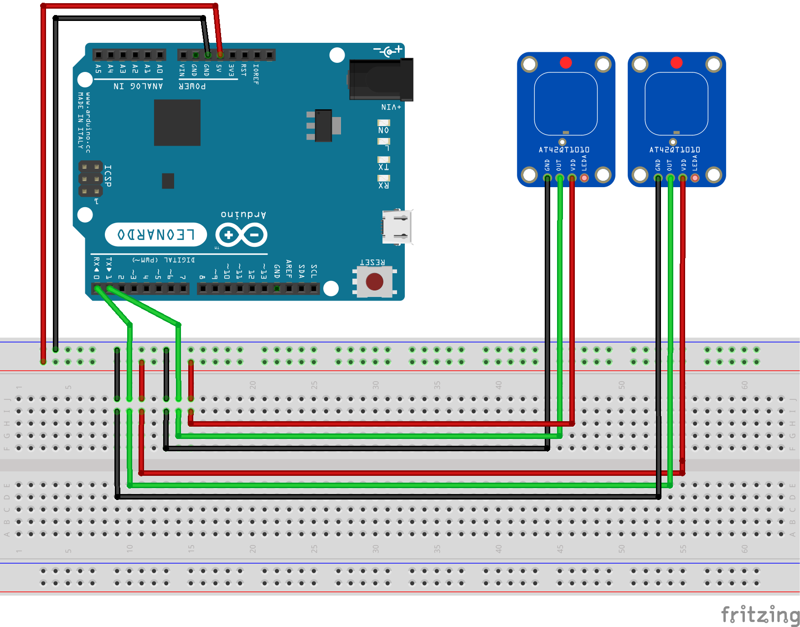

# Verkabelung

# Arduino Leonardo:

Die Leonardos sind per USB am Raspberry Pi angeschlossen und werden von diesem als Tastaturen erkannt.
Sie senden, abhängig vom ausgelösten Pin und den vorigen Arduinos, eine Zahleneingabe, gefolgt von _Enter_ um den 'Folienwechsel' am Pi auszulösen.

Die Software ist in C++ geschrieben und wird per PlatformIO auf die Arduino Leonardos geflasht.

Variablen in der Software sind:
* NUM_ARDUINO:
  * 0, 1, 2, ...
  * Nummer des Arduinos.
  * Wird benötigt um die richtige Zahl auszugeben.
* LAST_SENSOR_PREV:
  * 1, 2, ..., 12, 13
  * Anzahl der Sensoren am vorigen Arduino.
  * Wird ebenfalls für die richtige Zahl benötigt. In der Regel 13.
* LAST_SENSOR:
  * 0, 1, ..., 11, 12
  * Letzter angeschlossener Pin. An Pins danach wird sonst Unsinn ausgelesen.

# Raspberry Pi's

## Controller:

Beim Start des Controllers wird das Script */home/pi/Desktop/start.sh* ausgeführt. Das Script wird über die Startup-Funktion des LXDE-Desktops gestart. Konfiguriert, welches Script beim Start ausgeführt wird ist in */home/pi/.config/lxsession/LXDE-pi* festgelegt.

Der Controller ändert abhängig von den Tastatureingaben des Leonardos eine Javascript-Variable.
Er hostet weiterhin eine Webseite, die abhängig von der Javascript-Variable Bilder und Texte zum aktuellen Ort einbindet.Arduino Leonardo:

### controller_html.py
Öffnet das 'Terminal', in das die Eingaben der Arduinos geschrieben werden. **Das Terminal muss immer Fokus haben!**
Hier steht außerdem welche Pins zu welcher Sprache gehören. Das Script ändert also Javascript-Variablen für 'Folie' oder Sprache, je nach Eingabe.

Variablen in der Software sind:
* numLanguages = 3
  * Anzahl der unterschiedlichen Sprachen
* languagePins = [0, 1, 2]
  * de, en, nl
  * Pins für die Sprachbuttons (hier also 0,1,2 am ersten Arduino)
* language = "de"
  * Startsprache
* slide = 0
  * Startfolie

 Bei Änderungen schreibt das Script *Sprache* und *Folien-Index* in die *currentSlide.js*.

### Webseite
Als Webserver wird ein lighttpd eingesetzt. Dieser liefert die Websites für die beiden Monitore aus. Als Document-Root dient ist das Verzeichnis */home/pi/Desktop/share/zeitraum/Presentation_HTML*

Die *index.html* (bzw analog *index_projector.html*) lädt Javascript-Variablen aus der *currentSlide.js* und bindet abhängig von diesen das entsprechende Bild und die html-Datei aus dem jeweiligen Order ein.

Dazu ist in der *index.html* und in der *index_projector.html* eine Map, die den Foliennummern die Order zuweist:

	var map = {"0": "1_Start",
		"1": "2_Herrengarten",
		"2": "3_Martinikirche"};

## Beamer / Monitor

Die Raspberry Pis an den Monitoren und am Beamer starten einen Browser im Vollbild, der die Webseite des Controller-Pis anzeigt.

*start_presentation_projector_html.sh* und *start_presentation_monitor\_html.sh*
